# 玩Android-Flutter客户端

[](https://flutter.io/)[]()

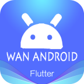

## 前言

- 这是一款使用Flutter编写的，MaterialDesign风格的WanAndroid客户端应用
- 这是一个可以用来入门Flutter的项目，我用了两周的晚上时间完成了第一个版本的开发
- [项目完全开源](https://github.com/shijiacheng/wanandroid_flutter)，欢迎Star&Fork，有问题请提交Issues，个人项目，请勿商用


## 更新日志

### V0.1.0(2019-01-18)

- 完成首页、知识体系、公众号、导航、项目、搜索等各个页面。
- 采用MD风格的设计，拥有较好的项目结构，比较规范的代码和封装。
- 支持日间和夜间模式的无感切换。
- 暂不支持用户注册和登录、收藏等功能。


## 下载

- Android Apk下载：点击下载V0.1.0
- 扫描二维码下载
- 暂不支持IOS版本下载，请自行clone项目代码运行。


## App截图

| 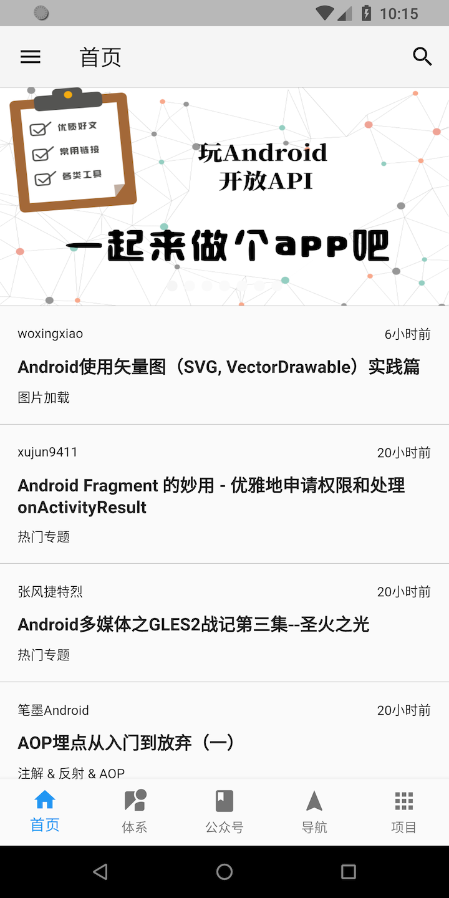 | 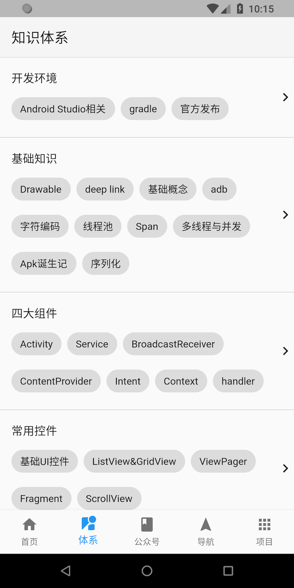 | 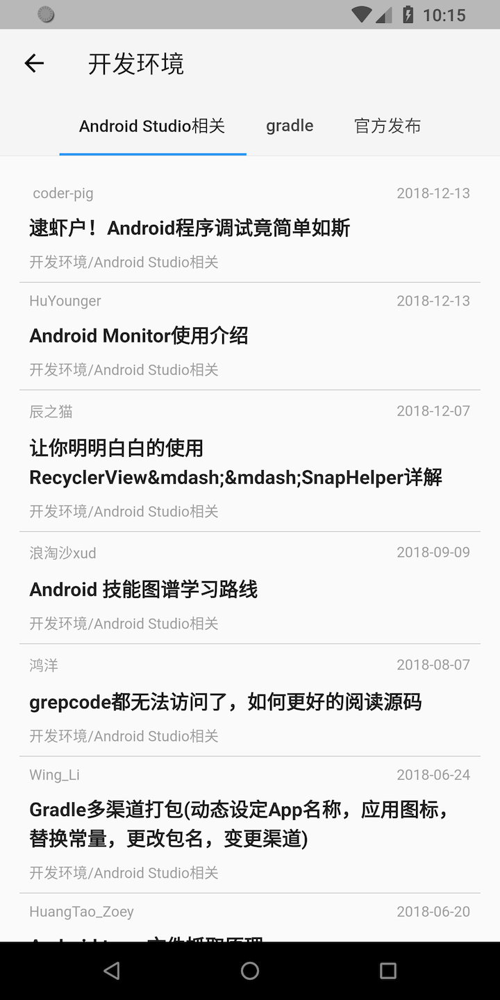 |
| ----------------------------------------- | ----------------------------------------- | ----------------------------------------- |
| 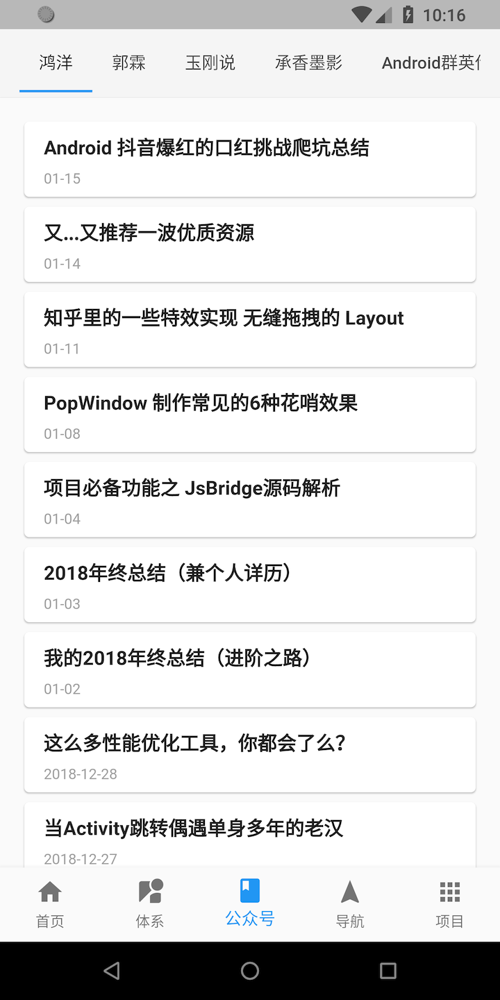 | 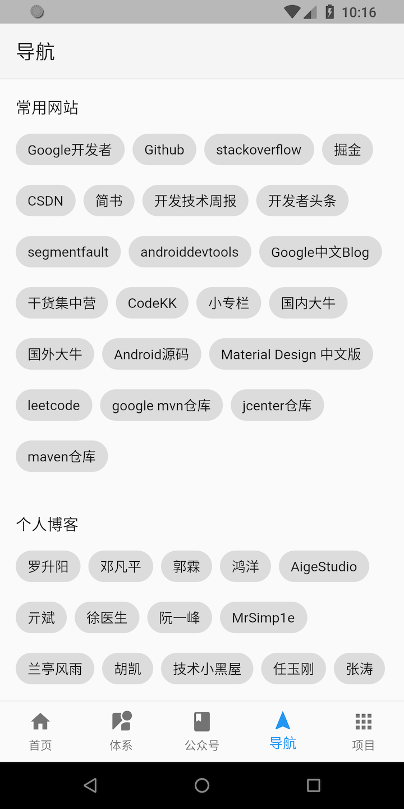 | 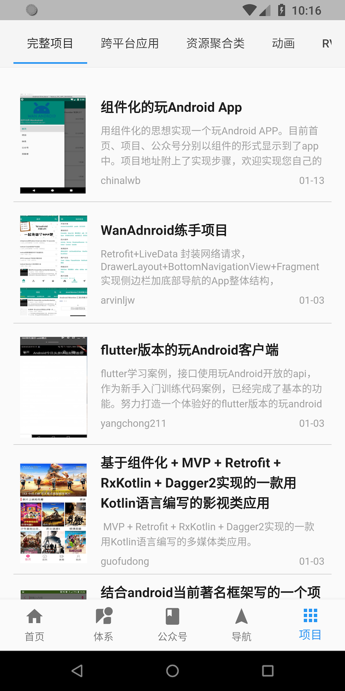 |
| 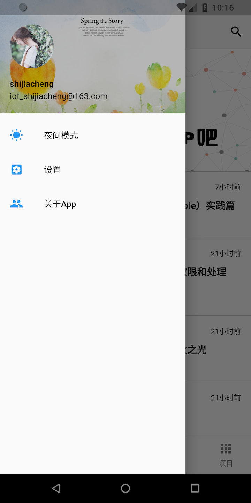 | 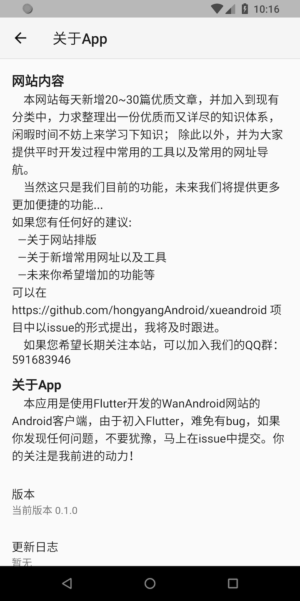 | 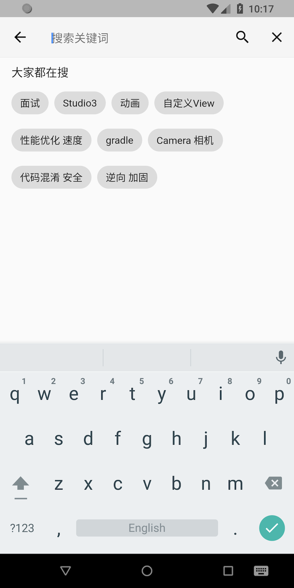 |
| 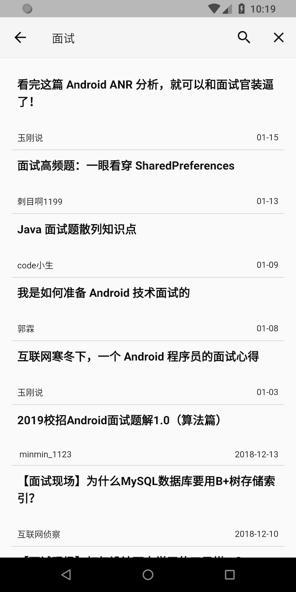 | 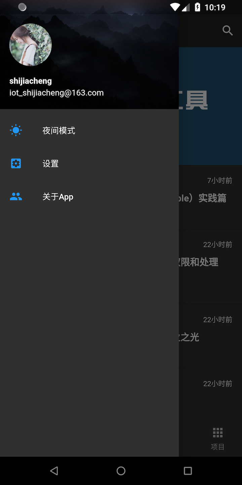 | 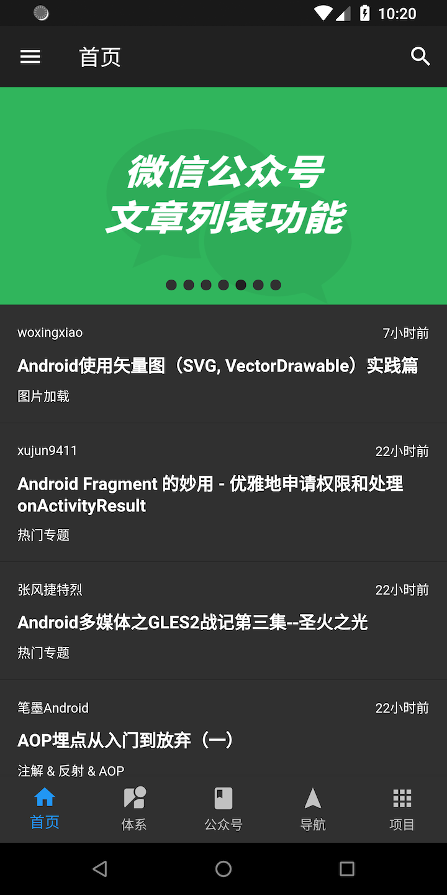 |


## App目录结构

>- |--lib
>    - |-- api (接口和接口实现类)
>    - |-- common (常量)
>    - |-- event (Eventbus相关)
>    - |-- model (数据请求实体类)
>    - |-- net (网络请求库封装)
>    - |-- ui (页面相关Page)
>    - |-- utils (工具类)
>    - |-- widget (自定义控件)
>    - |-- main.dart (程序入口)

## 感谢

1. 感谢鸿洋大神及[玩Android官网](http://www.wanandroid.com/)提供的[开放API](http://www.wanandroid.com/blog/show/2)。
2. 感谢pubspec.yaml中用到的所有开源库的作者。


## 开源库

- [cupertino_icons](https://pub.flutter-io.cn/packages/cupertino_icons)

- [flutter_swiper](https://pub.flutter-io.cn/packages/flutter_swiper)

- [flutter_webview_plugin](https://pub.flutter-io.cn/packages/flutter_webview_plugin)

- [dio](https://pub.flutter-io.cn/packages/dio)

- [shared_preferences](https://pub.flutter-io.cn/packages/shared_preferences)

- [fluttertoast](https://pub.flutter-io.cn/packages/fluttertoast)

- [event_bus](https://pub.flutter-io.cn/packages/event_bus)


## 关于作者

帝都Android程序员，初识Flutter~

[](https://github.com/shijiacheng)[](https://www.jianshu.com/u/8d4386810c3a)[](http://shijiacheng.studio/)


## 版权声明

```
Copyright 2018 Shijiacheng

Licensed under the Apache License, Version 2.0 (the "License");
you may not use this file except in compliance with the License.
You may obtain a copy of the License at

    http://www.apache.org/licenses/LICENSE-2.0

Unless required by applicable law or agreed to in writing, software
distributed under the License is distributed on an "AS IS" BASIS,
WITHOUT WARRANTIES OR CONDITIONS OF ANY KIND, either express or implied.
See the License for the specific language governing permissions and
limitations under the License.
```